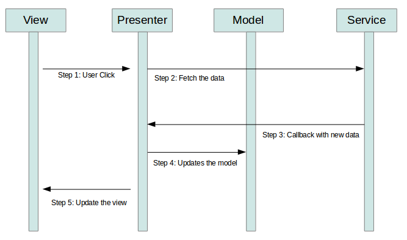

# ANDROID-MVP-ARCHITECTURE

Android MVP architecture with ButterKnife + Retrofit2 + RxJava2 + Room + Dagger

## Libraries

- [ButterKnife](http://jakewharton.github.io/butterknife/) : is a light weight library to inject
  views into Android components. It uses annotation processing.
- [Retrofit](http://square.github.io/retrofit/) : A type-safe REST client for Android which
  intelligently maps an API into a client interface using annotations.
- [Dagger](https://google.github.io/dagger/) : Dagger is a fully static, compile-time dependency
  injection framework for both Java and Android.
- [RxJava2](https://github.com/ReactiveX/RxJava) : Reactive Extensions for the JVM – a library for
  composing asynchronous and event-based programs using observable sequences for the Java VM.
- [Room](https://developer.android.com/training/data-storage/room/) : Room provides an abstraction
  layer over SQLite to allow fluent database access while harnessing the full power of SQLite.

